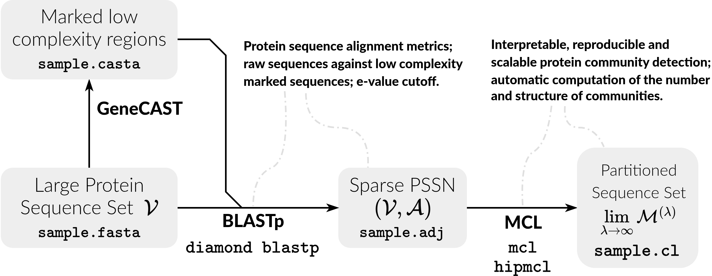

# bioscflow

### Description

This is a tool that applies community detection on protein sequence similarity networks using MCL or HipMCL from a FASTA input file.

### Workflow



### Deployment

First, `git-clone` this project and create the required directories by navigating inside the project's directory and entering:

```bash
make
```

Deploy the following dependencies and place them inside `:/vendor` or wherever else you prefer:

| Tool | Source | Symlink target |
|------|--------|----------------|
| GeneCAST | [github:1_genecast](https://github.com/bcpl-certh/cgg-toolkit/tree/main/1_genecast) | `libexec/cast` |
| DIAMOND | [github:diamond](https://github.com/bbuchfink/diamond) | `libexec/diamond` |
| MCL | [github:mcl](https://github.com/micans/mcl) | `libexec/mcxload`, `libexec/mcl` |
| HipMCL | [bitbucket:hipmcl](https://bitbucket.org/azadcse/hipmcl) | `libexec/hipmcl` |

Finally, create symbolic links of the dependencies' executables and place them inside `:/libexec`.

The entry point is `:/run.py` and can be executed using a Python (v3) intepreter. To understand its usage simply apply
```bash
python3 run.py --help
```

### Input Data

The input (`--db DB`) is a FASTA file where each record header starts with a unique identifier. Hence each record follows the format below:
```
>RECORD_IDENTIFIER OPTIONAL_ATTRIBUTES
SEQ_BLOCK
```
A recommended format is CoGent++ (Goldovsky et al., 2005).

### Directory Structure

```
:/
|-- asset
|-- data
|   |-- raw        # Raw input FASTA files.
|   |-- interim    # Intermediate files (.casta, .adj, .mci, .tab).
|   |-- cluster    # Clustered data and session logs.
|
|-- libexec        # Executables and symlinks of dependencies.
|-- vendor         # External deployed dependencies.
|-- tmp            # Interim files and data.
|-> run.py
|-> README.md
|-> Makefile
|-> .gitignore
```

### Session Report (`.json`)

For each run, a JSON session report is saved in `data/cluster/` with the naming pattern:

`session_report_DATASET_ALGORITHM_INFLATION_TIMESTAMP.json`

A copy is also saved as `session_report_last.json` (overwritten each run).

Example:

```json
{
  "algorithm": "mcl",
  "inflation": 2.5,
  "dataset_name": "sample",
  "dataset_size": 10000,
  "n_significant_edges": 45231,
  "n_clusters": 1250,
  "datetime": "d20250418t153022",
  "delta_t": 124.7,
  "delta_t_h": "02m:04s",
  "subprocess_id": ["CAST", "BLAST", "FILTER", "COMDET"],
  "exit_code_per_subprocess": [0, 0, 0, 0]
}
```

Attributes:

| Field | Description |
|-------|-------------|
| `algorithm` | Clustering algorithm used (`mcl` or `hipmcl`) |
| `inflation` | MCL inflation parameter |
| `dataset_name` | Basename of input FASTA file |
| `dataset_size` | Number of sequences in input |
| `n_significant_edges` | Edges retained after E-value filtering |
| `n_clusters` | Number of output clusters |
| `datetime` | UTC timestamp of run |
| `delta_t` | Total runtime in seconds |
| `delta_t_h` | Human-readable runtime |
| `subprocess_id` | Names of pipeline stages |
| `exit_code_per_subprocess` | Exit code for each stage (0 = success) |

Each subprocess corresponds to a major pipeline identifier: masking (CAST), alignment (BLAST), filtering (FILTER), and community detection (COMDET). The same order is applied for the exit codes.

### Reference

```
@article{cggToolkit,
  title     = "{CGG} toolkit: Software components for computational genomics",
  author    = "Vasileiou, Dimitrios and Karapiperis, Christos and Baltsavia, Ismini and Chasapi, Anastasia and Ahr{\'e}n, Dag and Janssen, Paul J and Iliopoulos, Ioannis and Promponas, Vasilis J and Enright, Anton J and Ouzounis, Christos A",
  journal   = "PLoS Computational Biology",
  volume    = 19,
  number    = 11,
  pages     = "e1011498",
  year      = 2023,
  doi       = "10.1371/journal.pcbi.1011498"
}

@article{cogent,
  title     = "{CoGenT++}: an extensive and extensible data environment for computational genomics",
  author    = "Goldovsky, Leon and Janssen, Paul and Ahr{\'e}n, Dag and Audit, Benjamin and Cases, Ildefonso and Darzentas, Nikos and Enright, Anton J. and L{\'o}pez-Bigas, N{\'u}ria and Peregrin-Alvarez, Jos{\'e} M. and Smith, Mike and Tsoka, Sophia and Kunin, Victor and Ouzounis, Christos A.",
  journal   = "Bioinformatics",
  volume    = 21,
  number    = 19,
  pages     = "3806--3810",
  year      = 2005,
  doi       = "10.1093/bioinformatics/bti579"
}

@article{hipmcl,
  title     = "{HipMCL}: A High-Performance Parallel Implementation of the Markov Clustering Algorithm for Large-Scale Networks",
  author    = "Azad, Ariful and Pavlopoulos, Georgios A. and Ouzounis, Christos A.",
  journal   = "IEEE Transactions on Parallel and Distributed Systems",
  volume    = 29,
  number    = 11,
  pages     = "2452--2466",
  year      = 2018,
  doi       = "10.1109/TPDS.2018.2825398"
}

@article{diamond,
  title     = "Fast and sensitive protein alignment using {DIAMOND}",
  author    = "Buchfink, Benjamin and Xie, Chao and Huson, Daniel H.",
  journal   = "Nature Methods",
  volume    = 12,
  number    = 1,
  pages     = "59--60",
  year      = 2015,
  doi       = "10.1038/nmeth.3176"
}

@phdthesis{mcl,
  title     = "Graph Clustering by Flow Simulation",
  author    = "van Dongen, Stijn",
  school    = "University of Utrecht",
  year      = 2000,
  url       = "https://micans.org/mcl"
}
```
